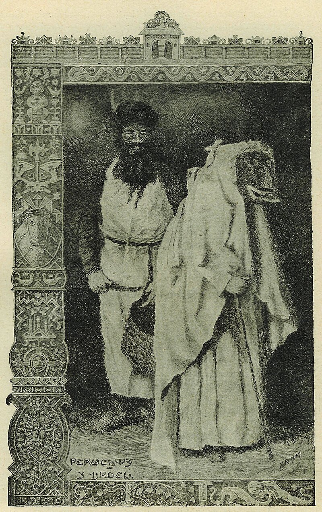
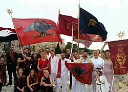
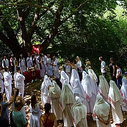
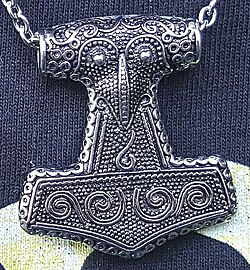

# Paganism

Paganism (from Latin paganus 'rural, rustic', later 'civilian') is a term first used in the fourth century by early Christians for people in the Roman Empire who practiced polytheism, or ethnic religions other than Christianity, Judaism, and Samaritanism. In the time of the Roman Empire, individuals fell into the pagan class either because they were increasingly rural and provincial relative to the Christian population, or because they were not milites Christi (soldiers of Christ). Alternative terms used in Christian texts were hellene, gentile, and heathen. Ritual sacrifice was an integral part of ancient Greco-Roman religion and was regarded as an indication of whether a person was pagan or Christian. Paganism has broadly connoted the "religion of the peasantry".

During and after the Middle Ages, the term paganism was applied to any non-Christian religion, and the term presumed a belief in false gods. The origin of the application of the term "pagan" to polytheism is debated. In the 19th century, paganism was adopted as a self-descriptor by members of various artistic groups inspired by the ancient world. In the 20th century, it came to be applied as a self-descriptor by practitioners of modern paganism, modern pagan movements and polytheistic reconstructionists. Modern pagan traditions often incorporate beliefs or practices, such as nature worship, that are different from those of the largest world religions.

Contemporary knowledge of old pagan religions and beliefs comes from several sources, including anthropological field research, the evidence of archaeological artifacts, philology of ancient language, and the historical accounts of ancient writers regarding cultures known to Classical antiquity. Most modern pagan religions existing today express a worldview that is polytheistic, pantheistic, panentheistic, or animistic, but some are monotheistic.

## Etymology and nomenclature

### Pagan

> It is crucial to stress right from the start that until the 20th century, people did not call themselves pagans to describe the religion they practiced. The notion of paganism, as it is generally understood today, was created by the early Christian Church. It was a label that Christians applied to others, one of the antitheses that were central to the process of Christian self-definition. As such, throughout history it was generally used in a derogatory sense.
>
><cite>Owen Davies, Paganism: A Very Short Introduction, 2011</cite>

The term pagan derives from Late Latin paganus, revived during the Renaissance. Itself deriving from classical Latin pagus which originally meant 'region delimited by markers', paganus had also come to mean 'of or relating to the countryside', 'country dweller', 'villager'; by extension, 'rustic', 'unlearned', 'yokel', 'bumpkin'; in Roman military jargon, 'non-combatant', 'civilian', 'unskilled soldier'. It is related to pangere ('to fasten', 'to fix or affix') and ultimately comes from Proto-Indo-European *pag- ('to fix' in the same sense):

>The adoption of paganus by the Latin Christians as an all-embracing, pejorative term for polytheists represents an unforeseen and singularly long-lasting victory, within a religious group, of a word of Latin slang originally devoid of religious meaning. The evolution occurred only in the Latin west, and in connection with the Latin church. Elsewhere, Hellene or gentile (ethnikos) remained the word for pagan; and paganos continued as a purely secular term, with overtones of the inferior and the commonplace.
>
><cite>Peter Brown, Late Antiquity, 1999</cite>

Medieval writers often assumed that paganus as a religious term was a result of the conversion patterns during the Christianization of Europe, where people in towns and cities were converted more easily than those in remote regions, where old ways tended to remain. However, this idea has multiple problems. First, the word's usage as a reference to non-Christians pre-dates that period in history. Second, paganism within the Roman Empire centred on cities. The concept of an urban Christianity as opposed to a rural paganism would not have occurred to Romans during Early Christianity. Third, unlike words such as rusticitas, paganus had not yet fully acquired the meanings (of uncultured backwardness) used to explain why it would have been applied to pagans.

Paganus more likely acquired its meaning in Christian nomenclature via Roman military jargon (see above). Early Christians adopted military motifs and saw themselves as Milites Christi (soldiers of Christ). A good example of Christians still using paganus in a military context rather than a religious one is in Tertullian's De Corona Militis XI.V, where the Christian is referred to as paganus (civilian):

Paganus acquired its religious connotations by the mid-4th century. As early as the 5th century, paganos was metaphorically used to denote persons outside the bounds of the Christian community. Following the sack of Rome by the Visigoths just over fifteen years after the Christian persecution of paganism under Theodosius I, murmurs began to spread that the old gods had taken greater care of the city than the Christian God. In response, Augustine of Hippo wrote De Civitate Dei Contra Paganos ('The City of God against the Pagans'). In it, he contrasted the fallen "city of Man" with the "city of God", of which all Christians were ultimately citizens. Hence, the foreign invaders were "not of the city" or "rural".

The term pagan was not attested in the English language until the 17th century. In addition to infidel and heretic, it was used as one of several pejorative Christian counterparts to goy (גוי / נכרי) as used in Judaism, and to kafir (كافر, 'unbeliever') and mushrik (مشرك, 'idolater') as in Islam.

### Helene

In the Latin-speaking Western Roman Empire of the newly Christianizing Roman Empire, Koine Greek became associated with the traditional polytheistic religion of Ancient Greece and was regarded as a foreign language (lingua peregrina) in the west. By the latter half of the 4th century in the Greek-speaking Eastern Empire, pagans were—paradoxically—most commonly called Hellenes (Ἕλληνες, lit. "Greeks") The word had almost entirely ceased being used in a cultural sense. It retained that meaning for roughly the first millennium of Christianity.s

This was influenced by Christianity's early members, who were Jewish. The Jews of the time distinguished themselves from foreigners according to religion rather than ethno-cultural standards, and early Jewish Christians would have done the same. Since Hellenic culture was the dominant pagan culture in the Roman east, they referred to pagans as Hellenes. Christianity inherited Jewish terminology for non-Jews and adapted it to refer to non-Christians with whom they were in contact. This usage is recorded in the New Testament. In the Pauline epistles, Hellene is almost always juxtaposed with Hebrew regardless of actual ethnicity.

The usage of Hellene as a religious term was initially part of an exclusively Christian nomenclature, but some Pagans began to defiantly call themselves Hellenes. Other pagans even preferred the narrow meaning of the word from a broad cultural sphere to a more specific religious grouping. However, there were many Christians and pagans alike who strongly objected to the evolution of the terminology. The influential Archbishop of Constantinople Gregory of Nazianzus, for example, took offence at imperial efforts to suppress Hellenic culture (especially concerning spoken and written Greek) and he openly criticized the emperor.

The growing religious stigmatization of Hellenism had a chilling effect on Hellenic culture by the late 4th century.

By late antiquity, however, it was possible to speak Greek as a primary language while not conceiving of oneself as a Hellene. The long-established use of Greek both in and around the Eastern Roman Empire as a lingua franca ironically allowed it to instead become central in enabling the spread of Christianity—as indicated for example, by the use of Greek for the Epistles of Paul. In the first half of the 5th century, Greek was the standard language in which bishops communicated, and the Acta Conciliorum ("Acts of the Church Councils") were recorded originally in Greek and then translated into other languages.

### Heathen

"Heathen" comes from Old English: hæðen (not Christian or Jewish); cf. Old Norse heiðinn. This meaning for the term originated from Gothic haiþno (gentile woman) being used to translate Hellene in Wulfila's Bible, the first translation of the Bible into a Germanic language. This may have been influenced by the Greek and Latin terminology of the time used for pagans. If so, it may be derived from Gothic haiþi (dwelling on the heath). However, this is not attested. It may even be a borrowing of Greek ἔθνος (ethnos) via Armenian hethanos.

The term has recently been revived in the forms "Heathenry" and "Heathenism" (often but not always capitalized), as alternative names for the modern Germanic pagan movement, adherents of which may self-identify as Heathens.

## Perception and Ethnocentrism

Paganism came to be equated by Christians with a sense of hedonism, representing those who are sensual, materialistic, self-indulgent, unconcerned with the future, and uninterested in more mainstream religions. Pagans were usually described in terms of this worldly stereotype, especially among those drawing attention to what they perceived as the limitations of paganism.

Recently, the ethnocentric and moral absolutist origins of the common usage of the term pagan have been proposed, with scholar David Petts noting how, with particular reference to Christianity, "...local religions are defined in opposition to privileged 'world religions'; they become everything that world religions are not, rather than being explored as a subject in their own right." In addition, Petts notes how various spiritual, religious, and metaphysical ideas branded as "pagan" from diverse cultures were studied in opposition to Abrahamism in early anthropology, a binary he links to ethnocentrism and colonialism.

## History

### Prehistoric

- [Prehistoric religion](https://en.wikipedia.org/wiki/Prehistoric_religion)
    - [Paleolithic religion](https://en.wikipedia.org/wiki/Paleolithic_religion)

#### Bronze Age to Early Iron Age

- [Religions of the ancient Near East](https://en.wikipedia.org/wiki/Religions_of_the_ancient_Near_East)
    - [Ancient Egyptian religion](https://en.wikipedia.org/wiki/Ancient_Egyptian_religion)
    - [Ancient Semitic religion](https://en.wikipedia.org/wiki/Ancient_Semitic_religion)
    - [Ancient Iranian religion](https://en.wikipedia.org/wiki/Ancient_Iranian_religion)
    - [Ancient Mesopotamian religion](https://en.wikipedia.org/wiki/Ancient_Mesopotamian_religion)

### Ancient history

#### Classical antiquity

Ludwig Feuerbach defined the paganism of classical antiquity, which he termed Heidentum ('heathenry') as "the unity of religion and politics, of spirit and nature, of god and man",[47] qualified by the observation that man in the pagan view is always defined by ethnicity, i.e., As a result, every pagan tradition is also a national tradition. Modern historians define paganism instead as the aggregate of cult acts, set within a civic rather than a national context, without a written creed or sense of orthodoxy.

#### Late Antiquity

Pagan as a religious concept arose out of the development of Christianity, as an exonym to refer to certain non-Christian peoples and practices, both at the center of and in the outer reaches of the Roman Empire.

Early Christianity was one of several monotheistic cults within the Roman Empire, emerging from Second Temple Judaism and Hellenistic Judaism. It developed in context, relationship, and competition with other religions advocating both monotheism and polytheism. Early Christianity distinguished itself from these other religions through the concept of paganism, naming those "pagan" who did not worship "the one true God".

Notable monotheistic cults contemporary with Early Christianity included those of Dionysus, Neoplatonism, Mithraism, Gnosticism, and Manichaeanism.[citation needed] The cult of Dionysus is thought to have strongly influenced Early Christian themes, and is an example of how Christianity defined itself against "paganism" while incorporating "pagan" religious themes and practices. Numerous scholars have concluded that the conceptual construction of Jesus the wandering rabbi into the image of Christ the Logos, reflects direct influence from the cult of Dionysus, and the symbolism of wine and the importance it held in the mythology surrounding both Dionysus and Jesus Christ exemplifies this. Peter Wick argues that the use of wine symbolism in the Gospel of John, including the story of the Marriage at Cana at which Jesus turns water into wine, was intended to show Jesus as superior to Dionysus. The scene in The Bacchae wherein Dionysus appears before King Pentheus on charges of claiming divinity can be compared to the New Testament scene of Jesus being interrogated by Pontius Pilate.

### Christianisation

#### In Albania

Paganism in Albania serves as an example of how indigenous folk religious practices persisted under official policies of Christian conversion. Proto-Albanian speakers were Christianized under the Latin sphere of influence, specifically in the 4th century CE, as shown by the basic Christian terms in Albanian, which are of Latin origin and entered Proto-Albanian before the Gheg–Tosk dialectal diversification. Regardless of Christianization, paganism persisted among Albanians, and especially within the inaccessible and deep interior where Albanian folklore evolved over the centuries in a relatively isolated tribal culture and society. It has continued to persist, despite partially transformation by Christian, and later Muslim and Marxist beliefs, that were either to be introduced by choice or imposed by force. The Albanian traditional customary law (Kanun) has held a longstanding, unwavering, and sacred – although secular – unchallenged authority with a cross-religious effectiveness over the Albanians, which is attributed to an earlier pagan code common to all the Albanian tribes. Historically, the Christian clergy has vigorously fought, but without success, to eliminate the pagan rituals practiced by Albanians for traditional feasts and particular events, especially the fire rituals (Zjarri).

### Postclassical history

Pagan Continuity in Mani and Mistra (800–1100) Christianity was introduced late in Mani, with the first Greek temples converted into churches during the 11th century. Byzantine monk Nikon "the Metanoite" (Νίκων ὁ Μετανοείτε) was sent in the 10th century to convert the predominantly pagan Maniots. Although his preaching began the conversion process, it took over 200 years for the majority to accept Christianity fully by the 11th and 12th centuries. Patrick Leigh Fermor noted that the Maniots, isolated by mountains, were among the last Greeks to abandon the old religion, doing so towards the end of the 9th century:

> Sealed off from outside influences by their mountains, the semi-troglodytic Maniots themselves were the last of the Greeks to be converted. They only abandoned the old religion of Greece towards the end of the ninth century. It is surprising to remember that this peninsula of rock, so near the heart of the Levant from which Christianity springs, should have been baptised three whole centuries after the arrival of St. Augustine in far-away Kent.

According to Constantine VII in De Administrando Imperio, the Maniots were referred to as 'Hellenes' and only fully Christianized in the 9th century, despite some church ruins from the 4th century indicating early Christian presence. The region's mountainous terrain allowed the Maniots to evade the Eastern Roman Empire's Christianization efforts, thus preserving pagan traditions, which coincided with significant years in the life of Gemistos Plethon.

Another safe area for the pagans was the city of Harran which, Despite the persecution of its pagan inhabitants by Byzantine Emperor Maurice, remained a largely pagan city well into the early Islamic period. When the city was besieged by the armies of the Rashidun Caliphate in 639–640, it was the pagan community that negotiated its peaceful surrender. Under the subsequent rule of the caliphates, Harran became a major settlement within the Diyar Mudar region and retained a significant degree of autonomy. During the First Fitna, the people of Harran sided with Mu'awiya I over Ali at the Battle of Siffin in 657, which allegedly resulted in a brutal retaliation by Ali, who massacred much of the population.

Under the Umayyad Caliphate (661–750), Harran prospered and was selected as the capital by the last Umayyad caliph, Marwan II, from 744 to 750. This move may have been influenced by the city's pagan sympathies and its strategic position near the empire's eastern provinces. The city's prominence under Umayyad rule saw it grow as a cultural and scholarly center, with the establishment of the first Muslim university in 717 under Umar II, attracting scholars from across the Islamic world.

Although Harran lost its capital status under the Abbasid Caliphate, it continued to flourish, particularly during the reign of Harun al-Rashid (786–809), when its university became a key center for translation and intellectual activity. The local religion, blending elements of Mesopotamian paganism and Neoplatonism, persisted into the 10th century, though periodic decrees enforced conversions to Islam, especially under Al-Ma'mun in 830. Nonetheless, Harran retained its heterogeneity, with a population that included Muslims, Christians, Jews, and a variety of other religious groups.

The medieval church accused sects deemed heretical such as the Waldensians and Cathars of participating in pagan fertility rites.

#### Islam in Arabia

Arab paganism gradually disappeared during Muhammad's era through Islamization. The sacred months of the Arab pagans were the 1st, 7th, 11th, and 12th months of the Islamic calendar. After Muhammad had conquered Mecca he set out to convert the pagans. One of the last military campaigns that Muhammad ordered against the Arab pagans was the Demolition of Dhul Khalasa. It occurred in April and May 632 AD, in 10AH of the Islamic Calendar. Dhul Khalasa is referred to as both an idol and a temple, and it was known by some as the Ka'ba of Yemen, built and worshipped by polytheist tribes.

## Modern paganism

### 21st century

In the 2000s, Associazione Tradizionale Pietas began reconstructing temples across Italy and sought legal recognition from the state, drawing inspiration from similar groups like YSEE in Greece. In 2023, Pietas participated in the ECER meeting, resulting in the signing of the Riga Declaration, which calls for the recognition of European ethnic religions. Public rituals, such as those celebrating the ancient festival of the Natale di Roma, have also resumed in recent years.

The idea of practicing Roman religion in the modern era has spread beyond Italy, with practitioners found in countries across Europe and the Americas. The most prominent international organization is Nova Roma, founded in 1998, with active groups worldwide.

Modern paganism, or Neopaganism, includes reconstructed practice such as Roman Polytheistic Reconstructionism, Hellenism, Slavic Native Faith, Celtic Reconstructionist Paganism, or heathenry, as well as modern eclectic traditions such as Wicca and its many offshoots, Neo-Druidism, and Discordianism.

However, there often exists a distinction or separation between some polytheistic reconstructionists such as Hellenism and revivalist neopagans like Wiccans. The divide is over numerous issues such as the importance of accurate orthopraxy according to ancient sources available, the use and concept of magic, which calendar to use and which holidays to observe, as well as the use of the term pagan itself.

In 1717 John Toland became the first Chosen Chief of the Ancient Druid Order, which became known as the British Circle of the Universal Bond. Many of the revivals, Wicca and Neo-Druidism in particular, have their roots in 19th century Romanticism and retain noticeable elements of occultism or Theosophy that were current then, setting them apart from historical rural (paganus) folk religion. Most modern pagans, however, believe in the divine character of the natural world and paganism is often described as an Earth religion.

There are a number of neopagan authors who have examined the relation of the 20th-century movements of polytheistic revival with historical polytheism on one hand and contemporary traditions of folk religion on the other. Isaac Bonewits introduced a terminology to make this distinction.

<dl>
    <dt>Neopaganism</dt>
    <dd>The overarching contemporary pagan revival movement which focuses on nature-revering, living, pre-Christian religions or other nature-based spiritual paths, and frequently incorporating contemporary liberal values.[citation needed] This definition may include groups such as Wicca, Neo-Druidism, Heathenry, and Slavic Native Faith.</dd>
</dl>

<dl>
    <dt>Paleopaganism</dt>
    <dd>A retronym coined to contrast with Neopaganism, original polytheistic, nature-centered faiths, such as the pre-Hellenistic Greek and pre-imperial Roman religion, pre-Migration period Germanic paganism as described by Tacitus, or Celtic polytheism as described by Julius Caesar.</dd>
</dl>

<dl>
    <dt>Mesopaganism</dt>
    <dd>A group, which is, or has been, significantly influenced by monotheistic, dualistic, or nontheistic worldviews, but has been able to maintain an independence of religious practices. This group includes aboriginal Americans as well as Aboriginal Australians, Viking Age Norse paganism and New Age spirituality. Influences include: Spiritualism, and the many Afro-Diasporic faiths like Haitian Vodou, Santería and Espiritu religion. Isaac Bonewits includes British Traditional Wicca in this subdivision.</dd>
</dl>

Prudence Jones and Nigel Pennick in their A History of Pagan Europe (1995) classify pagan religions as characterized by the following traits:

- Polytheism: Pagan religions recognise a plurality of divine beings, which may or may not be considered aspects of an underlying unity (the soft and hard polytheism distinction).
- Nature-based: Some pagan religions have a concept of the divinity of nature, which they view as a manifestation of the divine, not as the fallen creation found in dualistic cosmology.
- Sacred feminine: Some pagan religions recognize the female divine principle, identified as the Goddess (as opposed to individual goddesses) beside or in place of the male divine principle as expressed in the Abrahamic God.

In modern times, Heathen and Heathenry are increasingly used to refer to those branches of modern paganism inspired by the pre-Christian religions of the Germanic, Scandinavian and Anglo-Saxon peoples.

In Iceland, the members of Ásatrúarfélagið account for nearly 2% of the total population, therefore being nearly six thousand people. In Lithuania, many people practice Romuva, a revived version of the pre-Christian religion of that country. Lithuania was among the last areas of Europe to be Christianized. Heathenry has been established on a formal basis in Australia since at least the 1930s.