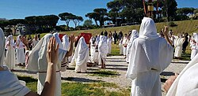
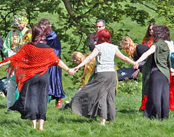

# Modern paganism

## 21st century

In the 2000s, Associazione Tradizionale Pietas began reconstructing temples across Italy and sought legal recognition from the state, drawing inspiration from similar groups like YSEE in Greece. In 2023, Pietas participated in the ECER meeting, resulting in the signing of the Riga Declaration, which calls for the recognition of European ethnic religions. Public rituals, such as those celebrating the ancient festival of the Natale di Roma, have also resumed in recent years.

The idea of practicing Roman religion in the modern era has spread beyond Italy, with practitioners found in countries across Europe and the Americas. The most prominent international organization is Nova Roma, founded in 1998, with active groups worldwide.

Modern paganism, or Neopaganism, includes reconstructed practice such as Roman Polytheistic Reconstructionism, Hellenism, Slavic Native Faith, Celtic Reconstructionist Paganism, or heathenry, as well as modern eclectic traditions such as Wicca and its many offshoots, Neo-Druidism, and Discordianism.

However, there often exists a distinction or separation between some polytheistic reconstructionists such as Hellenism and revivalist neopagans like Wiccans. The divide is over numerous issues such as the importance of accurate orthopraxy according to ancient sources available, the use and concept of magic, which calendar to use and which holidays to observe, as well as the use of the term pagan itself.

In 1717 John Toland became the first Chosen Chief of the Ancient Druid Order, which became known as the British Circle of the Universal Bond. Many of the revivals, Wicca and Neo-Druidism in particular, have their roots in 19th century Romanticism and retain noticeable elements of occultism or Theosophy that were current then, setting them apart from historical rural (paganus) folk religion. Most modern pagans, however, believe in the divine character of the natural world and paganism is often described as an Earth religion.

There are a number of neopagan authors who have examined the relation of the 20th-century movements of polytheistic revival with historical polytheism on one hand and contemporary traditions of folk religion on the other. Isaac Bonewits introduced a terminology to make this distinction.

<dl>
    <dt>Neopaganism</dt>
    <dd>The overarching contemporary pagan revival movement which focuses on nature-revering, living, pre-Christian religions or other nature-based spiritual paths, and frequently incorporating contemporary liberal values.[citation needed] This definition may include groups such as Wicca, Neo-Druidism, Heathenry, and Slavic Native Faith.</dd>
</dl>

<dl>
    <dt>Paleopaganism</dt>
    <dd>A retronym coined to contrast with Neopaganism, original polytheistic, nature-centered faiths, such as the pre-Hellenistic Greek and pre-imperial Roman religion, pre-Migration period Germanic paganism as described by Tacitus, or Celtic polytheism as described by Julius Caesar.</dd>
</dl>

<dl>
    <dt>Mesopaganism</dt>
    <dd>A group, which is, or has been, significantly influenced by monotheistic, dualistic, or nontheistic worldviews, but has been able to maintain an independence of religious practices. This group includes aboriginal Americans as well as Aboriginal Australians, Viking Age Norse paganism and New Age spirituality. Influences include: Spiritualism, and the many Afro-Diasporic faiths like Haitian Vodou, Santería and Espiritu religion. Isaac Bonewits includes British Traditional Wicca in this subdivision.</dd>
</dl>

Prudence Jones and Nigel Pennick in their A History of Pagan Europe (1995) classify pagan religions as characterized by the following traits:

- Polytheism: Pagan religions recognise a plurality of divine beings, which may or may not be considered aspects of an underlying unity (the soft and hard polytheism distinction).
- Nature-based: Some pagan religions have a concept of the divinity of nature, which they view as a manifestation of the divine, not as the fallen creation found in dualistic cosmology.
- Sacred feminine: Some pagan religions recognize the female divine principle, identified as the Goddess (as opposed to individual goddesses) beside or in place of the male divine principle as expressed in the Abrahamic God.

In modern times, Heathen and Heathenry are increasingly used to refer to those branches of modern paganism inspired by the pre-Christian religions of the Germanic, Scandinavian and Anglo-Saxon peoples.

In Iceland, the members of Ásatrúarfélagið account for nearly 2% of the total population, therefore being nearly six thousand people. In Lithuania, many people practice Romuva, a revived version of the pre-Christian religion of that country. Lithuania was among the last areas of Europe to be Christianized. Heathenry has been established on a formal basis in Australia since at least the 1930s.